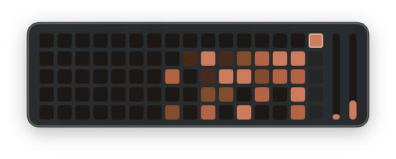

# Claude Code Usage Widget

A macOS desktop widget that shows your Claude Code usage as a GitHub-style contribution grid with real-time rate limit bars.



## Quick Start

```bash
git clone https://github.com/emmettarmstrong/usage-widget.git
cd usage-widget
make install
```

This builds the app and copies it to `/Applications`. Launch `UsageWidget.app` — the contribution grid works immediately if you use Claude Code.

## Features

- **Contribution grid** — 16-week heatmap of daily message activity (Mon-Fri), colored by intensity
- **Rate limit bars** — Vertical bars showing 5-hour and 7-day API utilization, filled from bottom
- **Live updates** — Stats refresh every 30s from local logs, API data every 60s
- **Hover tooltips** — Hover any cell to see day, date, and message count; hover a bar to see utilization % and reset time
- **Today indicator** — Current day cell has a white border
- **Future days** — Remaining weekdays in the current week show as dimmed cells
- **Desktop overlay** — Floats above the desktop, draggable, persists position across launches
- **Menu bar icon** — Refresh data or quit from the menu bar

## Requirements

- macOS 15.0+ (Sequoia)
- Xcode 16.0+ (with command line tools)
- An active Claude Code installation (`~/.claude/` directory)

## How Authentication Works

### Local Files (always works)

The contribution grid reads from two local sources — no API key or login needed:

1. **`~/.claude/stats-cache.json`** — Historical daily message counts, generated by Claude Code automatically
2. **`~/.claude/projects/*/*.jsonl`** — Live session transcript files, scanned for today's activity

If you use Claude Code, these files already exist.

### API Rate Limits (optional)

The rate limit bars fetch data from the Anthropic API using your Claude Code OAuth token. This token is stored in the **macOS Keychain** by Claude Code when you log in — the widget reads it automatically.

- Keychain service: `Claude Code-credentials`
- The widget reads the token via `/usr/bin/security` CLI (no Apple Developer account needed)
- If the token isn't found (e.g. you haven't logged into Claude Code), the bars simply won't appear

### Plan Detection

Your plan tier (Free, Pro, Max, Max 5x, Max 20x) is read from `~/.claude/.credentials.json` and displayed on hover.

## Bundle ID Configuration

The app ships with the bundle ID `com.emmett.UsageWidget`. If you want your own (e.g. for Keychain isolation or multiple installs), change it in one command:

```bash
make setup BUNDLE_ID=com.yourname.UsageWidget
```

This updates all 3 locations where the bundle ID appears (project.pbxproj Debug + Release configs, and the entitlements file).

## Build Options

```bash
make build      # Build Release .app to build/Build/Products/Release/
make install    # Build + copy to /Applications
make uninstall  # Remove from /Applications
make clean      # Remove build/ directory
```

The Makefile uses ad-hoc code signing (`CODE_SIGN_IDENTITY="-"`), so no Apple Developer account is required. The app uses the `/usr/bin/security` CLI to read the Keychain, which works without entitlements-based code signing.

### Launch at Login

Add `UsageWidget.app` to **System Settings > General > Login Items** to start it automatically.

## Setup with Claude Code

If you're using Claude Code to set up this widget, paste this prompt:

> Clone and install the Claude Code Usage Widget. Read the CLAUDE.md for build commands and project structure. Run `make install` to build and install to /Applications, then launch the app. If my bundle ID needs to change, use `make setup BUNDLE_ID=com.myname.UsageWidget` first.

## Usage

The widget is entirely hover-driven — no labels clutter the display.

| Element | What it shows | On hover |
|---------|--------------|----------|
| Grid cell | Daily activity intensity | Day name, date, message count |
| White-bordered cell | Today | Same as above |
| Dimmed cells | Future days this week | Day name, date |
| Left bar | 5-hour rolling utilization | Percentage + time until reset |
| Right bar | 7-day rolling utilization | Percentage + time until reset |

### Color Scale (Grid)

| Color | Messages |
|-------|----------|
| Dark (#1D1816) | 0 |
| Dim (#4A2A1A) | 1-50 |
| Medium (#8B4A25) | 51-300 |
| Bright (#C15F3C) | 301-1000 |
| Brightest (#DA7756) | 1000+ |

### Bar Colors

| Color | Utilization |
|-------|------------|
| Orange (#DA7756) | 0-49% |
| Yellow (#E8A84C) | 50-74% |
| Deep orange (#E07030) | 75-89% |
| Red (#CC3333) | 90%+ |

## Troubleshooting

### Rate limit bars not showing

The bars require a valid OAuth token in the macOS Keychain. This is set automatically when you log into Claude Code.

1. Make sure you're logged into Claude Code (`claude` in terminal — if it opens, you're logged in)
2. Check the Keychain has the credential: `security find-generic-password -s "Claude Code-credentials" 2>&1 | head -5`
3. If nothing shows up, log out and back in to Claude Code

### Widget not updating

- The widget refreshes local stats every 30 seconds and API data every 60 seconds
- If the grid shows stale data, click the menu bar icon (chart icon) and select **Refresh**
- If the app appears frozen after sleep, quit and relaunch — App Nap prevention is built in but macOS can still suspend in rare cases

### Build errors

- **"No such module"**: Make sure you're building the `UsageWidget` scheme, not a test target
- **Code signing errors**: The Makefile uses ad-hoc signing. If building in Xcode directly, set signing to "Sign to Run Locally" in Build Settings
- **Deployment target**: Requires macOS 15.0+ (Sequoia). Check your macOS version with `sw_vers`

### Keychain permission prompts

The first time the app reads from the Keychain, macOS may show a permission dialog. Click **Allow** (or **Always Allow** to suppress future prompts).

## Architecture

```
UsageWidget/
├── App/
│   ├── AppDelegate.swift          # Window panel, menu bar, position persistence
│   └── UsageWidgetApp.swift       # App entry point
├── Models/
│   ├── ContributionDay.swift      # Day data model + intensity levels
│   └── StatsCache.swift           # JSON decode for stats-cache.json
├── ViewModels/
│   └── StatsViewModel.swift       # Data loading, grid building, API polling
├── Views/
│   ├── ContentView.swift          # Root layout (grid + bars)
│   ├── ContributionGraphView.swift # Grid of cells
│   ├── ContributionCellView.swift  # Individual cell with hover
│   └── UsageLimitBarView.swift    # Vertical rate limit bars
└── Utilities/
    ├── FileWatcher.swift          # DispatchSource file monitor
    ├── LiveStatsComputer.swift    # Parses JSONL conversation logs
    └── UsageAPIClient.swift       # Anthropic API usage endpoint
```
